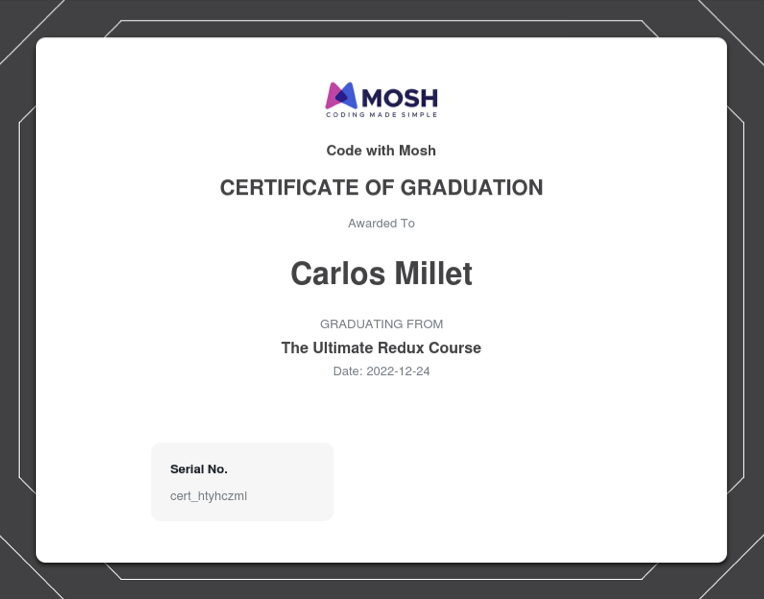
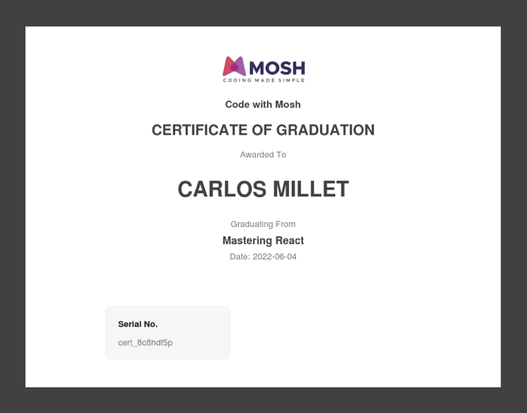
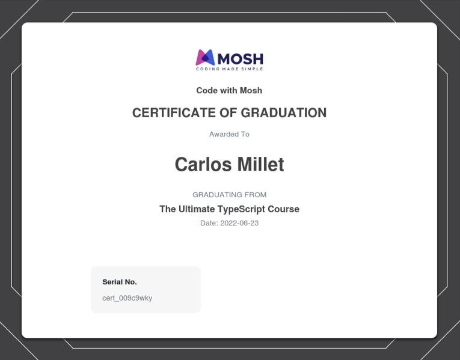
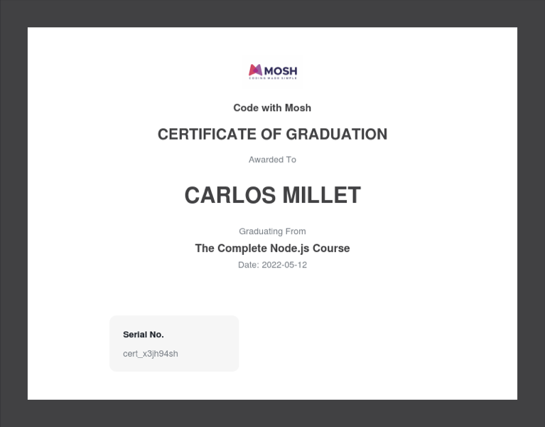
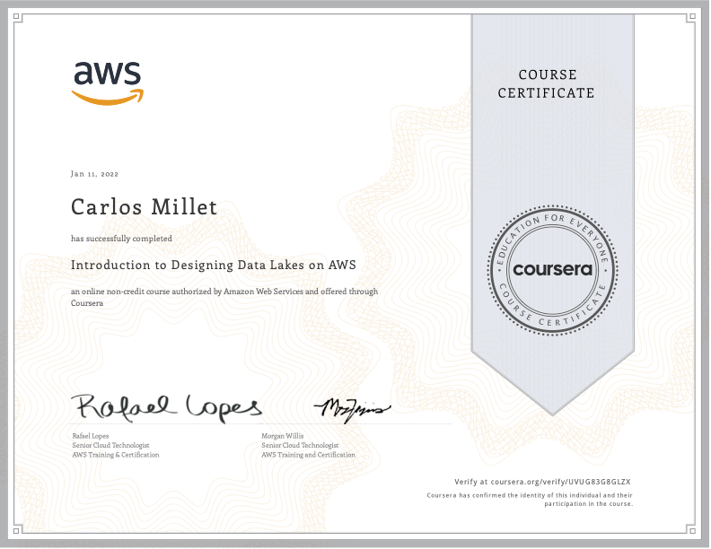
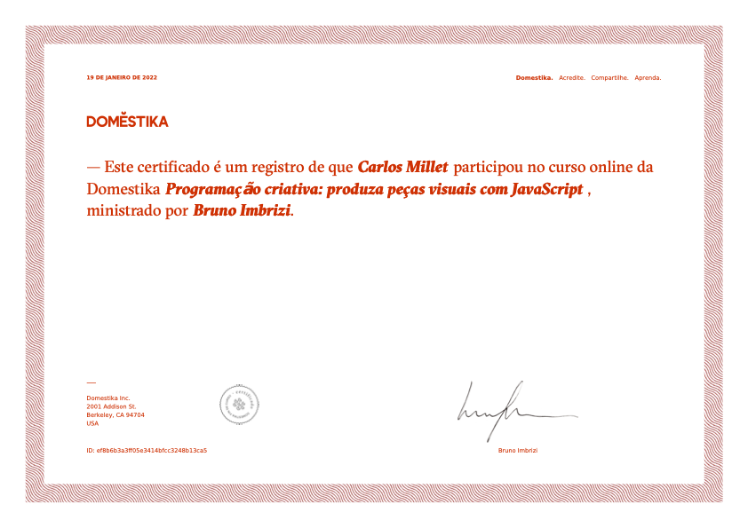

# Resume
Carlos Eduardo Lima Millet  
24 years  
cadumillet@icloud.com

## About me
IT professional with diversified skill set encompassing web development, project management, product design and copywriting. Worked in different market segments, such as financial business and wastewater/sewage treatment systems. My focus was to develop fully responsive web applications (client and server sides).

5+ years combined development and technical leadership.  
7+ years combined management, marketing, design, UX and TI. 

## Experience

### Provider IT
- **Mid-Senior Full Stack Developer**  
Jun 2022 - present day

> Implemented features that includes multi-step forms with deep validation, file upload and preview, error handling and interactions.
> 
> Redesigned and reorganized application components for new layout version with typescript.
> 
> Designed architecture and implemented interfaces and API's for smart services built with IOT data: push notifications, plan subscribing, crud operations, dashboards and more.  
>  
> Techs: ReactJS, NodeJS, Express, MySQL, Sequelize, TypeORM, Typescript, Formik, Redux, Styled
Components, Babel, Webpack, React Router, NPM, Yarn, Google Analytics.  
> Tools: VS Code, Figma, GitLab.

### Crédito One
- **Mid-Senior Full Stack Developer**  
Jun 2019 - Jul 2022  

> Built website and landing pages applying SEO strategies and integration with third-party applications. Developed B2C web app using React and Node: crud operations for clients and orders registration, cron jobs for messaging and data pipeline, interface and API for contract signing.  
> 
> Techs: Javascript, React, Node, Express, MongoDB, Typescript, NextJS, Strapi, Heroku, Sendgrid, Twilio, Zapier.  
> Tools: Webflow, VS Code, Google Cloud, GitHub, Bitbucket, Hubspot.

- **Project Manager and Front-end Developer**  
Jan 2018 - Nov 2019

> Led Development and Marketing Teams applying agile principles. Deciding strategies, technologies and tools for developing maintainable applications and concise products.  
>
> Techs: HTML, CSS, Javascript.
> Tools: Notion, Airtable, Slack, Discord, Google Sheets, Google Data Studio, Google Apps Script.

- **UI/UX and Graphic Designer**  
Jun 2016 - Jan 2018

> Branding, copywriting and product designing for digital product including application interfaces, system architecture and design system. Social media and content management.  
> 
> Tools: Figma, Adobe XD, Adobe Photoshop, Adobe Illustrator.

## Certifications
- **The Ultimate Redux Course** 
Dec 2022 - [Code With Mosh](https://codewithmosh.com/p/ultimate-redux)

  

- **Mastering React** 
Jun 2022 - [Code With Mosh](https://codewithmosh.com/p/mastering-react)

  

- **The Ultimate Typescript Course** 
Jun 2022 - [Code With Mosh](https://codewithmosh.com/p/the-ultimate-typescript)

  

- **The Complete Node.js Course** 
May 2022 - [Code With Mosh](https://codewithmosh.com/p/the-complete-node-js-course)

  

- **Introduction to Design Data Lakes on AWS** 
Jan 2022 - [Coursera](https://www.coursera.org/learn/introduction-to-designing-data-lakes-in-aws/)

  

- **Programação criativa: produza peças visuais com Javascript** 
Jan 2022 - [Domestika](https://www.domestika.org/pt/courses/2729-programacao-criativa-produza-pecas-visuais-com-javascript)

  

